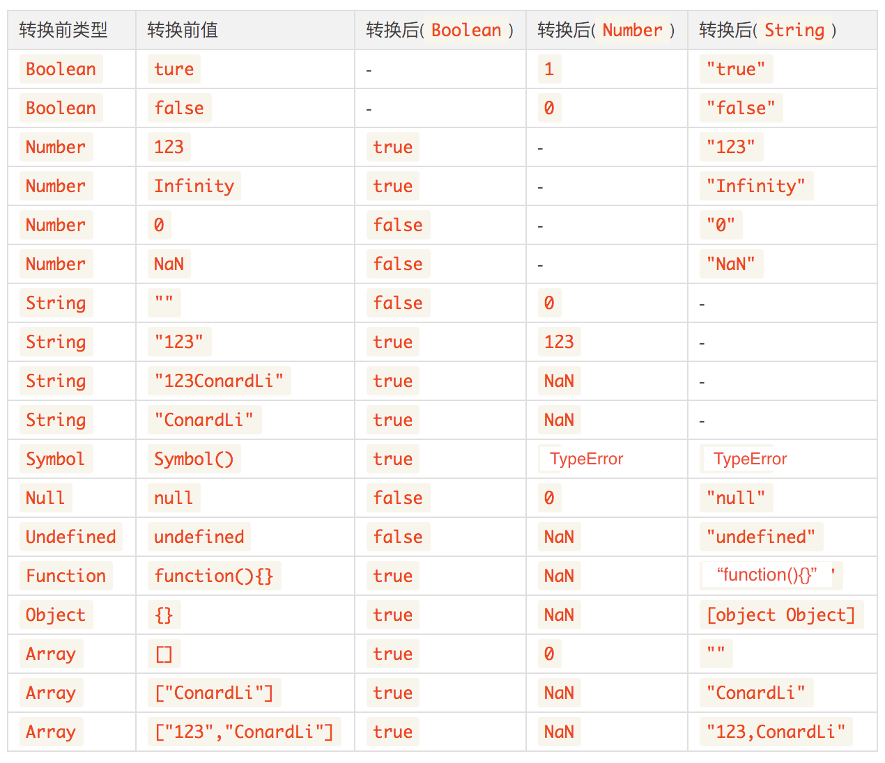

layout: post
read_time: true
show_date: true
title: '变量与类型'
date: 2021-07-19
img: posts/20210705/4.jpg
tags: [js基础]
category: opinion
author: 随步
description: 'js 变量与类型'
---

## 原始类型和引用类型
### 原始类型
#### Number
计算机中所有的数据都是以二进制存储的，所以在计算时计算机要把数据先转换成二进制进行计算，然后在把计算结果转换成十进制。
0.1+0.2!==0.3 是因为 

#### Symbol
总结：
Symbol帮助我们创建一个独一无二的Symbol变量，typeof可识别出Symbol。
Symbol()是一个函数，不是构造函数，不可使用new。
当Symbol变量作为对象的key，是不可被枚举的（object.keys, object.getOwnProperty()，for in 均不可获取属性，只可使用object.getOwnPropertySymbols()专门获取）
```javascript
var sym1 = Symbol();  // Symbol() 
var sym2 = Symbol('ConardLi');  // Symbol(ConardLi)
var sym3 = Symbol('ConardLi');  // Symbol(ConardLi)
var sym4 = Symbol({name:'ConardLi'}); // Symbol([object Object])
console.log(sym2 === sym3);  // false
```
两个相同的字符串创建两个Symbol变量，它们是不相等的，可见每个Symbol变量都是独一无二的。
如果我们想创造两个相等的Symbol变量，可以使用Symbol.for(key)。
```javascript
var sym1 = Symbol.for('ConardLi');
var sym2 = Symbol.for('ConardLi');
console.log(sym1 === sym2); // true
```
使用给定的key搜索现有的symbol，如果找到则返回该symbol。否则将使用给定的key在全局symbol注册表中创建一个新的symbol。

```javascript
var obj = {
  name:'suibu',
  [Symbol('name1')]:'dino'
}
Object.getOwnPropertyNames(obj); // ["suibu"]
Object.keys(obj); // ["name"]
for (var i in obj) {
   console.log(i); // name
}
Object.getOwnPropertySymbols(obj) // [Symbol(name)]
```
##### 应用一：私有属性
由于它有不可枚举的特性，导致如果外部正常使用，是拿不到_name属性的。
若是利用Object.getOwnPropertySymbol()还是可以拿到。
若是要使用私有属性，建议用TS，这些方法不够简洁。私有属性的特质：若是父类有私有属性，子类不可集成。并且私有属性的值外部不可更改。
```javascript
const Test = (() => {
    const _name = Symbol('name');
    class Test {
        constructor(){
            this[_name] = 'suibu';
        }
        get name(){
            return this[_name];
        }
        setName(val){
            this[_name] = val;
        }
    }
    return Test;
})()

const test = new Test()
console.log(test.name) // suibu
console.log(test._name) // undefined
console.log(test[Object.getOwnPropertySymbols(test)[0]]) // suibu
```

### 引用类型
`Array 数组`,`Date 日期`,`RegExp 正则`,`Function 函数`
他们原型链的终点都是Object
#### 包装类型 
ECMAScript提供了一些特殊的引用类型，他们是原始类型的包装类型：`Boolean`,`Number`,`String`
```javascript
// 注意原始类型和包装类型的区别：
true === new Boolean(true); // false
123 === new Number(123); // false
'ConardLi' === new String('ConardLi'); // false
console.log(typeof new String('ConardLi')); // object
console.log(typeof 'ConardLi'); // string
// FIXME: 原始类型和包装类型的区别总结，我还没看明白
```
##### 基本类型与包装类型之间的转换
抛出问题：既然原始类型不能扩展属性和方法，那么我们是如何使用原始类型调用方法的呢？
以下代码，到底是怎么运作的？
```javascript
var name = "suibu";
var name2 = name.substring(2);
```
1、创建一个String的包装类型实例：var name = new String('suibu')
2、在实例上调用substring方法
3、销毁实例


### 隐式转换和强制转换



## 值传递和引用传递
结论：函数的参数都是按值传递。
##### 1、若参数是原始类型，函数内部的参数相当于参数的副本，内部对变量的任何改动，都不会影响外部传入的指
```javascript
let name = 'suibu';
function changeValue(name){
    name = 'dino';
    console.log('inner', name)
}
changeValue(name);
console.log(name);
// inner dino
// suibu
```
##### 2、若参数是引用类型,副本是指向变量堆内存地址
```javascript
let obj = {};
function changeValue(obj){
    obj.name = 'suibu'; // 会改到堆内存地址中变量
    obj = { name: 'dino' } // 相当于给该变量，重新赋予了一个堆内存地址，
    console.log('inner:', obj)
}
changeValue(obj);
console.log(obj);
// inner { name: 'dino' }
// { name: 'suibu' }
```